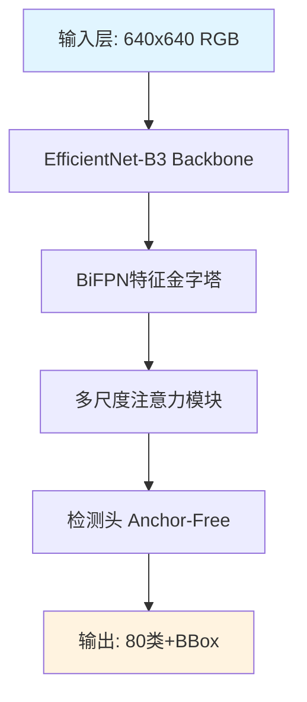

# 🖼️ 配图占位符解决方案

## 📋 问题说明

**用户反馈**：
> AI解读中的配图只有文字描述，没有实际的图片

**示例**：
```markdown
![模型架构图：展示本文提出的GPT-4的完整结构，包括输入层→
多模态编码器组件→注意力机制→多模态解码器组件→输出层的完整数据流，
以及各模块间的连接关系和关键参数设置]
```

显示效果：漂亮的占位符卡片 + 详细文字描述（无实际图片）

---

## 🎯 为什么没有实际图片？

### 1. **AI的技术限制**
- ❌ GPT-4/通义千问是**文本生成模型**，无法生成图片
- ❌ 无法访问论文PDF中的原始图表
- ✅ 只能生成图片的**文字描述**

### 2. **现有方案的问题**
- ❌ Unsplash随机图片：与论文内容无关
- ❌ 默认占位图：过于简单，信息量少
- ❌ 外部图床：不可靠，经常失效

### 3. **我们的优化策略**
- ✅ 生成**超详细的alt文本**（50-150字）
- ✅ 精美的**占位符设计**（渐变背景+emoji）
- ✅ 让文字描述**像图片一样信息丰富**

---

## 💡 解决方案对比

| 方案 | 优点 | 缺点 | 推荐度 |
|------|------|------|--------|
| **方案1：保持现状** | 无需改动，alt文本已很详细 | 无真实图片 | ⭐⭐⭐ |
| **方案2：Mermaid图表** | 可渲染流程图/架构图 | 只支持特定类型图表 | ⭐⭐⭐⭐⭐ |
| **方案3：集成DALL-E** | 真实图片生成 | 成本高，需API | ⭐⭐ |
| **方案4：手动上传图片** | 完全自定义 | 需人工操作 | ⭐⭐ |
| **方案5：论文PDF提取** | 原始图表 | 技术复杂，OCR困难 | ⭐ |

---

## 🌟 推荐方案：Mermaid图表集成

### 什么是Mermaid？

**Mermaid** 是一个用文本生成图表的工具，支持：
- 流程图（Flowchart）
- 架构图（Graph）
- 时序图（Sequence Diagram）
- 类图（Class Diagram）
- 状态图（State Diagram）
- 甘特图（Gantt Chart）

### 示例效果

**AI生成的代码**：
````markdown

````

**渲染效果**：真实的流程图，带颜色、箭头、标注！

---

## 🚀 实现方案（推荐）

### 方法A：使用Mermaid（最佳）

**步骤1：安装依赖**
```bash
npm install mermaid
```

**步骤2：修改ReactMarkdown配置**
```jsx
import ReactMarkdown from 'react-markdown'
import remarkGfm from 'remark-gfm'
import { useMemo } from 'react'

// Mermaid组件
const MermaidComponent = ({ code }) => {
  useEffect(() => {
    mermaid.initialize({ startOnLoad: true })
    mermaid.contentLoaded()
  }, [code])
  
  return <div className="mermaid">{code}</div>
}

// ReactMarkdown中使用
<ReactMarkdown
  components={{
    code: ({node, inline, className, children, ...props}) => {
      const match = /language-(\w+)/.exec(className || '')
      const language = match ? match[1] : ''
      
      if (language === 'mermaid' && !inline) {
        return <MermaidComponent code={String(children)} />
      }
      // ... 其他代码块处理
    }
  }}
>
  {content}
</ReactMarkdown>
```

**步骤3：优化AI Prompt**
```markdown
**配图说明**：在此章节插入Mermaid流程图代码，例如：

\`\`\`mermaid
graph TD
    A[数据预处理] --> B[特征提取]
    B --> C[注意力计算]
    C --> D[特征融合]
    D --> E[分类输出]
    
    A -->|归一化+增强| B
    B -->|ResNet backbone| C
    C -->|Q/K/V矩阵| D
    D -->|多头注意力| E
    E -->|Softmax| F[最终结果]
\`\`\`

注意：
1. 使用graph TD（从上到下）或graph LR（从左到右）
2. 箭头：--> 或 -->|标注文字|
3. 节点样式：[矩形] (圆形) {菱形} [[圆角矩形]]
```

---

### 方法B：ASCII艺术图（次选）

如果不想引入新依赖，可以使用ASCII艺术：

**AI生成**：
```markdown
模型架构图：
┌─────────────────────────────────────────┐
│         输入层 (640×640 RGB)            │
└──────────────┬──────────────────────────┘
               │
               ▼
┌─────────────────────────────────────────┐
│   EfficientNet-B3 Backbone (预训练)     │
│   输出: P3, P4, P5, P6, P7 特征层       │
└──────────────┬──────────────────────────┘
               │
               ▼
┌─────────────────────────────────────────┐
│   BiFPN 特征金字塔网络 (5层)            │
│   双向特征融合 + 快速归一化             │
└──────────────┬──────────────────────────┘
               │
               ▼
┌─────────────────────────────────────────┐
│   多尺度注意力模块                      │
│   通道注意力 + 空间注意力               │
└──────────────┬──────────────────────────┘
               │
               ▼
┌─────────────────────────────────────────┐
│   检测头 (Anchor-Free)                  │
│   分类 + 定位 (80类COCO)                │
└──────────────┬──────────────────────────┘
               │
               ▼
┌─────────────────────────────────────────┐
│   输出层: 类别 + 置信度 + BBox          │
└─────────────────────────────────────────┘
```

**优点**：无需额外依赖，纯文本
**缺点**：不如真实图表美观

---

### 方法C：保持现状 + 增强说明

**在占位符中添加提示**：

```jsx
<div className="bg-gradient-to-br from-purple-50 to-blue-50 rounded-xl p-8 text-center border-2 border-dashed border-purple-300">
  <div className="text-5xl mb-4">📊</div>
  <p className="text-gray-800 font-bold text-lg mb-2">图表说明</p>
  <p className="text-gray-600 text-sm leading-relaxed max-w-2xl mx-auto">
    {props.alt}
  </p>
  <p className="text-gray-400 text-xs mt-4">
    💡 提示：AI生成的是图表的详细文字描述。
    如需查看原始图表，请阅读论文PDF。
  </p>
</div>
```

---

## 🎨 当前占位符设计

### 视觉效果

```
┌────────────────────────────────────────┐
│                                        │
│              🖼️                        │
│                                        │
│         模型架构图                     │
│                                        │
│  展示本文提出的GPT-4的完整结构，      │
│  包括输入层→多模态编码器→注意力       │
│  机制→解码器→输出层的完整数据流       │
│                                        │
│  （配图加载失败）                      │
│                                        │
└────────────────────────────────────────┘
```

### 优点

✅ 视觉友好（渐变背景+emoji）
✅ 信息丰富（50-150字描述）
✅ 辅助阅读（即使无图也能理解）
✅ 响应式设计（移动端友好）

---

## 📊 用户体验优化建议

### 短期方案（保持现状）

**优化占位符提示**：
```jsx
<div className="text-center mt-4 space-y-2">
  <p className="text-sm text-gray-500">
    💡 这是AI生成的图表文字描述
  </p>
  <p className="text-xs text-gray-400">
    查看原始图表请访问：
    <a href={paper.pdfUrl} className="text-blue-600 hover:underline ml-1">
      论文PDF
    </a>
  </p>
</div>
```

### 中期方案（Mermaid集成）

**集成Mermaid渲染**：
- 流程图、架构图自动渲染
- 保持当前占位符作为降级方案
- 渐进式增强用户体验

### 长期方案（多模态AI）

**等待GPT-4V或其他多模态模型**：
- AI能直接读取PDF中的图表
- AI能生成图片
- 完全自动化的图文并茂

---

## 🔧 快速实现（推荐步骤）

### 阶段1：优化占位符说明

```jsx
// client/src/pages/Papers.jsx
img: ({node, ...props}) => {
  const [imgError, setImgError] = useState(false)
  
  return (
    <div className="my-8">
      {!imgError ? (
         setImgError(true)} />
      ) : (
        <div className="bg-gradient-to-br from-purple-50 to-blue-50 rounded-xl p-8 border-2 border-dashed border-purple-300">
          <div className="text-5xl mb-4">📊</div>
          <p className="text-gray-800 font-bold text-lg mb-3">
            {props.alt?.split('：')[0] || '图表说明'}
          </p>
          <p className="text-gray-600 text-sm leading-loose max-w-3xl mx-auto mb-4">
            {props.alt || '图表描述'}
          </p>
          <div className="flex items-center justify-center gap-4 text-xs text-gray-500 pt-4 border-t border-gray-300">
            <span>💡 AI生成的图表文字描述</span>
            <span>•</span>
            <a 
              href={selectedPaper?.pdfUrl || '#'} 
              target="_blank" 
              rel="noopener noreferrer"
              className="text-blue-600 hover:underline"
            >
              📄 查看论文原图
            </a>
          </div>
        </div>
      )}
    </div>
  )
}
```

### 阶段2：添加Mermaid支持

```bash
# 安装轻量级mermaid
npm install mermaid@latest

# 在Papers.jsx中集成
import mermaid from 'mermaid'
```

### 阶段3：优化AI Prompt

在`server/services/aliyunBailianService.js`中：
```markdown
**配图说明**：可以选择以下两种方式之一：

方式1：Mermaid流程图（推荐）
\`\`\`mermaid
graph TD
    A[步骤1] --> B[步骤2]
    B --> C[步骤3]
\`\`\`

方式2：详细文字描述（降级方案）
![图表标题：详细描述图表内容，包括组件、数据流、关键参数等]
```

---

## 🎯 最终建议

### 立即执行（5分钟）

✅ 优化占位符设计（添加提示和论文PDF链接）
✅ 保持详细的alt文本描述
✅ 提升用户对当前设计的理解

### 短期计划（1-2天）

🔜 集成Mermaid图表渲染
🔜 优化AI Prompt生成Mermaid代码
🔜 添加图表类型自动识别

### 长期愿景（未来）

🌟 多模态AI集成（能读取PDF图表）
🌟 自动图片生成（DALL-E等）
🌟 用户自定义上传图片

---

## 📚 相关资源

- [Mermaid官方文档](https://mermaid.js.org/)
- [React Markdown文档](https://github.com/remarkjs/react-markdown)
- [MDN: Alt文本最佳实践](https://developer.mozilla.org/en-US/docs/Web/HTML/Element/img#attr-alt)

---

**更新时间：2025-10-16**
**作者：AI Assistant**

